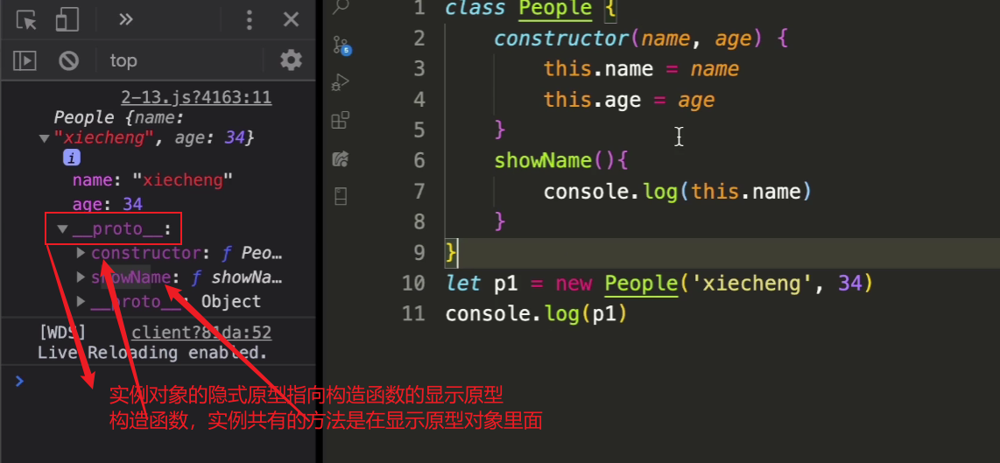

# 一、ES5：类相关

类的定义、实例属性、静态属性、实例方法、静态方法

实现是通过构造函数来实现的

```js
function People(name, age) {
  this.name = name
  this.age = age
}

let p1 = new People("zohnny", 18)

let p2 = new People("---nny", 17)

new构造调用，里面的this指向生成的实例对象
```

```js
实例的方法一般放在原型对象上面
People.protoType.showName = function() {
  console.log("我的名字是" + this.name)
}

实例对象的__proto__跟构造方法的protoType在内存里面指向同一块内存地址
```

```js
实例属性：和实例有关系的,定义在构造函数里面
this.name = name
this.age = age
```

```js
静态属性：定义在类里面
People.count = 0

每调用一次构造方法的时候；让这个值加加
function People(){
  People.count++
}
```

```js
let str = new String("zohnny")
console.log(str)

let arr = new Array(1, 2, 3)
console.log(arr)

let obj = new Object()
console.log(obj)

静态方法：和你实例化的对象是没有关系的，直接在类下面定义
例如：Math.max(4,5)
Math.random()

和Math相关的方法都是静态方法
```

```js
实例方法：构造函数原型下面的方法，跟实例相关
```

```js
静态方法：直接在类下面定义
People.getCount = function(){
  console.log(this) // constructor
  console.log("当前共有"+People.count+"个人")
}

调用：
People.getCount()

注意：静态方法里面的this指向构造函数
```

## ES5 类的继承

1. 构造函数继承：只能继承父类实例属性

```js
// 父类
function Animal(name) {
  this.name = name
}
Animal.protoType.showName = function() {
  console.log("名字是：" + this.name)
}

// 子类
function Dog(name, color) {
  Animal.call(this, name) // 继承属性
  this.color = color
}

let d1 = new Dag("金金毛", "yellow")

d1.showName() // 报错
此类继承只能继承父类的属性，不能继承父类的方法
```

2. 原型继承：只能继承父类实例方法

```js
// 父类
function Animal(name) {
  this.name = name
}
Animal.protoType.showName = function() {
  console.log("名字是：" + this.name)
}

// 子类
function Dog(name, color) {
  this.color = color
}

Dog.protoType = new Animal()
Dog.protoType.constructor = Dog

let d1 = new Dag("金金毛", "yellow")

d1.showName() // 名字是：undefined
```

3. 组合式继承：上面两种方式结合起来（父类实例属性和方法就都可以继承了）

---

es5 属性定义在构造函数里面、方法定义在原型下面，es5 类的继承组合式继承

## ES6

1. 定义

```js
class People {
  constructor(name, age) {
    this.name = name
    this.age = age
  }
  showName() {
    console.log(this.name)
  }
}

let p1 = new People("zohnny", 18)

es6是es5的语法糖
```

## es6 继承

```js
class Coder extends People {
  constructor(name, age, company) {
    super(name, age)
    this.company = company
  }
  showCompany() {
    console.log(this.company)
  }
}

let c1 = new Coder("zow", 20, "tencent")
c1.showName()
c1.showCompany()
```

## 顶层属性

```js
class People {
  get sex() {
    return "male"
  }
}

let p1 = new People("zow", 20)

1. 情况一
console.log(p1.sex) // 可以获取

2. 情况二
p1.sex = 'female'
console.log(p1.sex) // 报错、只有getter
```

```js
class People {
  constructor(name, age) {
    this.name = name
    this.age = age
    this._sex = -1 // 防止死循环定义的变量
  }
  get sex() {
    // 属性
    // return "male"
    return this._sex
  }
  set sex(val) {
    this._sex = val
  }
}

let p1 = new People("zow", 20)
p1.sex = "female"
console.log(p1.sex)
```

顶层属性的作用：在对属性设置和获取的时候可以进行相应的拦截，可以写一些业务逻辑的操作。在设置的时候用 1 和 0 表示 male 和 female，设置的时候给\_sex 设置 1 或 0，在获取的时候，1 则返回 male，0 则返回 female。这些是 constructor 里面直接赋值所达不到的效果

```js
get sex(){
  if(this._sex === 1){
    return "male"
  }else if(this._sex === 0){
    return "female"
  }else {
    return "error"
  }
}

set sex(val){
  if(val === 0 || val=== 1)
  this._sex = val
}

p.sex = 1 // male
p.sex = 0 // female
p.sex = 5 // error
```

这些顶层属性也是可以被子类继承过去，可设置可获取

```js
class Coder extends People {}
let c1 = new Coder("zhangsan", 18)
c1.sex = 1
console.log(c1.sex)
```

## 静态方法，实例不可调用(static 属性)

```js
class People {
  static getCount() {
    // static关键字去定义静态方法
    return 5
  }
}
console.log(People.getCount()) // 5
```

:::tip Coder 继承了 People，那静态方法同样可以调用
console.log(Coder.getCount()) // 5
:::

## 静态属性

**es6 明确规定：class 内部只能够定义静态方法**
所以 es6 静态属性跟 es5 一样的：通过*类名.属性*的方式去定义静态属性

```js
People.count = 5

console.log(People.count)
```

typeof People === "function" es6 的类本质还是构造函数，就是 es5 的语法糖

## 隐式原型与显示原型对象



## 类相关关键字

class

extends

constructor

static

super

get/set

## class 实现继承注意事项

1. class 声明不会变量提升，Foo 进入暂时性死区，类似 let、const

```js
let foo = new Foo() // ReferenceError:Foo is not defined

class Foo {
  constructor() {
    this.foo = 42
  }
}
```

2. class 内部声明会启用严格模式

```js
class Foo {
  constructor() {
    foo = 42 // ReferenceError:foo is not defined
  }
}

let foo = new Foo()
```

3. class 的所有方法（包括静态方法和实例方法）都是不可枚举的

```js
function Bar() {
  this.bar = 42
}
Bar.answer = function() {
  return 42
}
Bar.prototype.print = function() {
  console.log(this.bar)
}
const barKeys = Object.keys(Foo) // ["answer"]
const barProtoKeys = Object.keys(Foo.prototype) // ["print"]
```

```js
class Foo {
  constructor() {
    this.foo = 42
  }
  // 静态方法
  static answer() {
    return 42
  }

  // 实例方法
  print() {
    console.log("this.foo")
  }
}
const fooKeys = Object.keys(Foo) // []
const fooProtoKeys = Object.keys(Foo.prototype) // []
```

5. 必须使用 new 调用 class

```js
class Foo {
  constructor() {
    this.foo = 5
  }
}
const foo = Foo() // TypeError:Class constructor Foo cannot be invoked without 'new'
```

6. class 内部无法重写类名

```js
class Foo {
  constructor() {
    this.foo = 42
    Foo = "Fol" // 报错：TypeError: Assignment to constant variable
  }
}

let foo = new Foo()
console.log(foo)
Foo = "Fol" // it's ok
```
