# diff 算法是什么东西

**一、新旧 vnodes 对比过程的算法就是 diff 算法**

数组中间插入一个元素，Vue 要怎么做性能才是最高的？

思考 1：直接把全部的 li 删除，再生成新的。

思考 2：把 c 变 f，d 变 c，再增加一个 d

最高性能：diff 增加该增加的，不动的保持不动

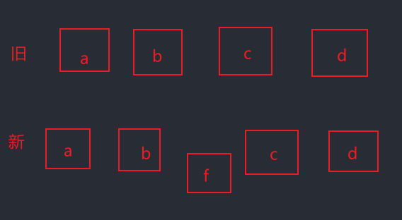

---

**二、VNode 的全称是 Virtual Node，也就是虚拟节点**

无论是组件还是元素，在 Vue 中的表现都是一个个的 VNode

VNode 的本质是一个 javascript 对象

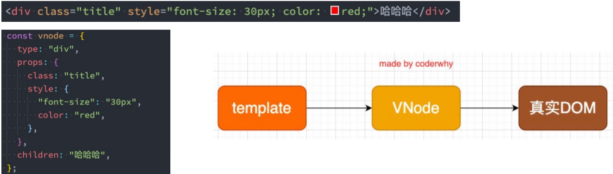

如果不是一个 div 元素，而是一大堆元素，则形成 VNode Tree

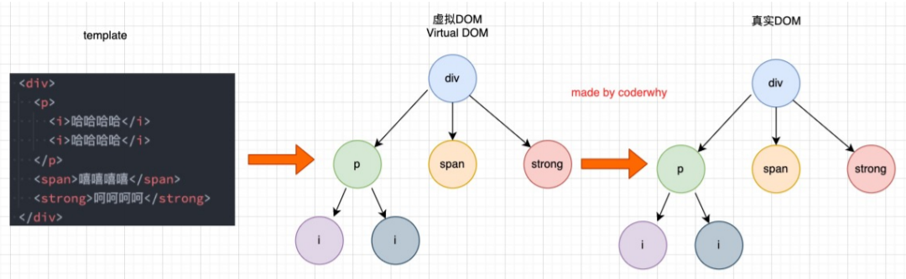

---

**三、Vue 对于有 key 和没有 key 会采用不同的方法**

源码位置：packages/runtime-core/src/renderer.ts

1609 行：通过 patchFlag 判断有没有放 key，去调用不同的方法

---

> 无 key，复用节点，修改内容（children）

没有 key 的时候：把新旧 vnodes（数组）传进去，遍历（for 循环）数组短的，进行新旧 vnodes 比较，不同，patch 更新 nodes。遍历完，判断新旧节点的长度，旧的长，删掉多余的，新的长，创建新节点，挂载到新的 vnodes 里面

**遍历的时候拿到新数组里面的每一个 vnode 节点和就数组里面的每一个 vnode 进行比较 patch（旧的虚拟 dom 是数组对象，新的也是）**

c1 是 patch 第一个参数，没有 key 的时候，取到新旧 vnodes 的时候是直接进行 patch 操作的，有 key 的时候，在 patch 前才需要判断 node 的 type 和 key 一不一样

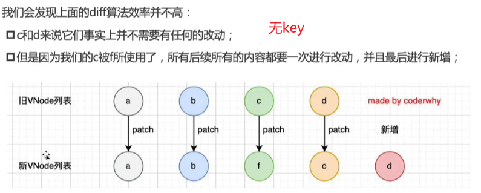

源码：

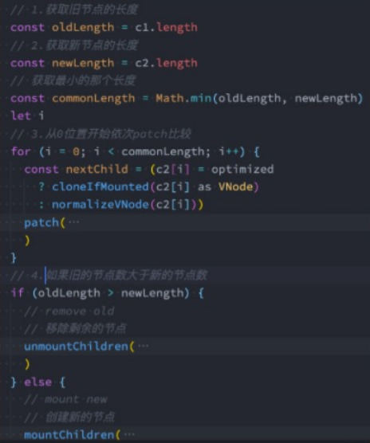

---

> 有 key 的五步操作

1. 有 key 的时候：分别拿到新旧中的两个 vnode 进行**从头开始**比较，判断 n1 的 type 和 n2 的 type、n1 的 key 和 n2 的 key 一不一样，一样则进行 patch 操作，否则，进行 break 跳出循环

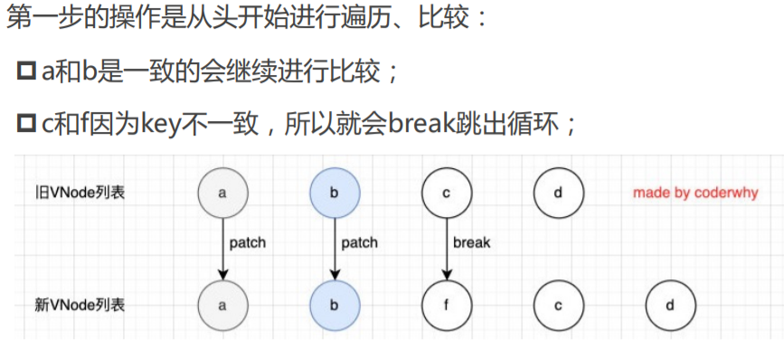

2. 接下来**从尾部开始**比较，同类型同 key 则 patch，否则跳出循环

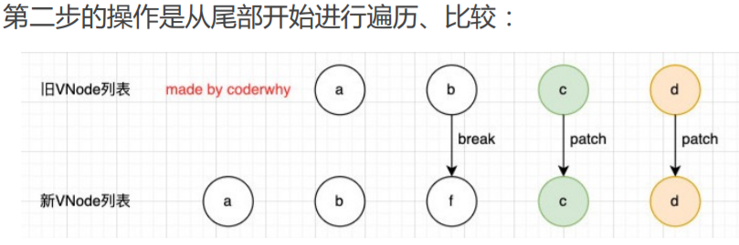

3. 下一步：新节点比较多的话，就进行挂载操作

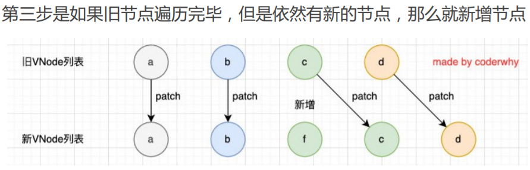

4. 在下一步（下一个循环）：判断旧节点比较多的话，则执行卸载操作，把旧的多余的给删掉

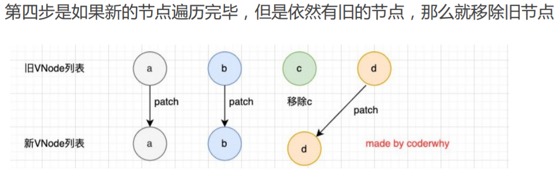

5. 最后一步：从头比较完，从后比较完，中间的新旧节点数目一样，（尽可能去旧的里面找一样的）尽可能用一样的**进行 patch 操作**，新节点有，旧的没有，则挂载。新节点没有，旧节点有，则卸载

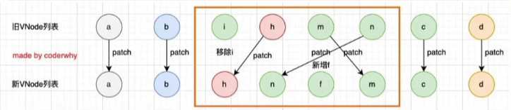

源码：e1 是其中一个虚拟 dom 对象数组的长度，e2 是另一个

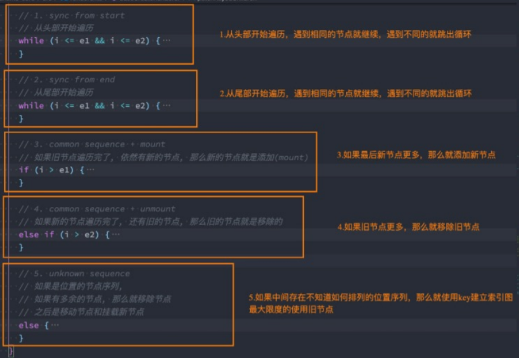

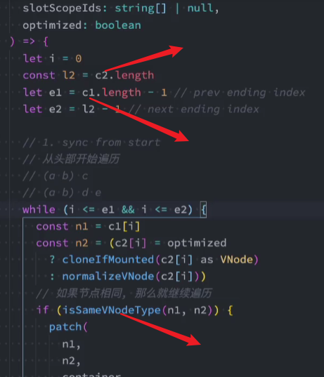

:::tip
diff 之后的新 vnodes 最终生成新的真实 dom，diff 的时候，尽可能的复用旧的 vnodes

没有 key 的时候效率是非常低效的

在插入或进行重置顺序的时候，保持相同的 key 可以让 diff 算法更高效

所以 key 的作用就是：用在 Vue 的虚拟 dom 的 diff 算法中的

:::

新旧 nodes === 新旧节点

新旧 vnodes === 新旧虚拟 dom
