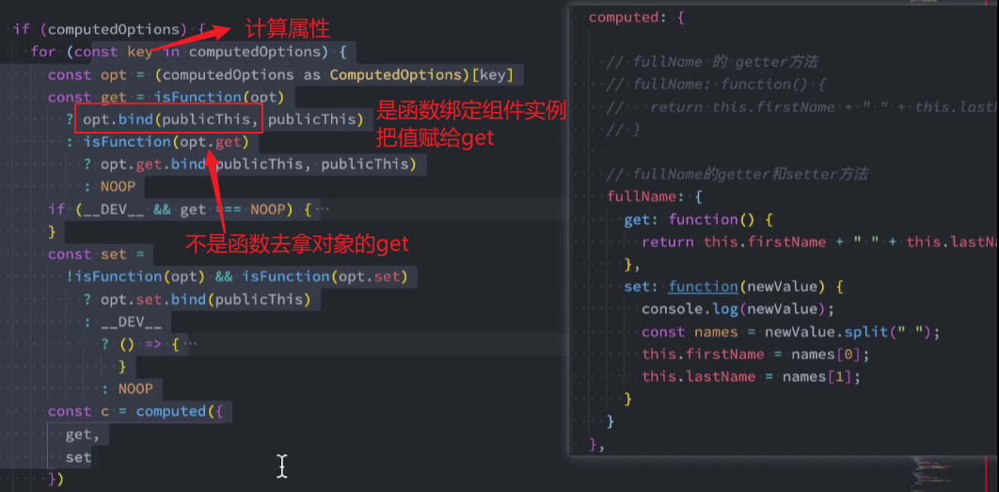
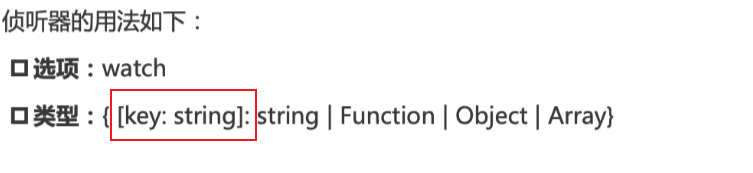

# 计算属性

### 1. 复杂 data 的处理方式

模板中可直接通过插值语法显示一些 data 中的数据（表达式）

需要对多个 data 数据进行运算（名字拼接）、三元运算符来决定结果（及格不及格）、数据进行某种转化后显示（字符串翻转）

**实现方式有**

\*\*\* 模板语法（重复代码、无缓存、难维护）

\*\*\* methods 实现（无缓存，看起来是函数调用）

\*\*\* computed 实现

表达式设计初衷是用于简单的运算，太多的逻辑会让模板过重和难以维护，这时候就出现了计算属性

---

### 2. computed：是 options 的其中一个属性，两种写法，function/{get，set}，get 和 set 会自动绑定为当前组件实例。

有缓存，多次使用，计算过程只会执行一次。

会随依赖数据的改变，而进行重新计算，并把结果缓存下来

:::tip
对于任何包含响应式数据的复杂逻辑，你都应该使用计算属性
计算属性将被混入到组件实例中。所有 getter 和 setter 的 this 上下文自动地绑定为组件实例
:::

---

### 3. 计算属性写函数的话，就相当于只实现了 get，是原本写法的语法糖

```js
// 原本写法
fullName:{
  get:function(){
    return this.firstName + this.lastName
  },
  set(val){ // 计算属性也是可以修改值的
    const nameArr = val.split(' ')
    this.firstName = nameArr[0]
    this.lastName = nameArr[1]
  }
}
```

源码：



# 侦听器 watch

### 1. 使用场景：当 data 中的某个属性发生变化的时候，进行一些逻辑的处理（网络请求...）



```js
// 基本使用
<input v-model="question"/>

watch:{
  // question是侦听的data中的属性名称
  // newValue变化后的新值
  // oldValue变化后的旧值
  question(newValue,oldValue){
    this.queryAnswer() // 实时的去搜索答案
  }
},
methods:{
  queryAnswer(){
    console.log(`你的问题${this.question}的答案是哈哈哈哈哈哈`)
  }
}
```

### 2. 侦听器的配置选项

```js
data(){
  return {
    info:{}
  }
}
```

**默认情况下，只会侦听数据本身的改变，内部（info 的属性）发生的改变是不会侦听的**

```js
深度侦听：函数写法是对象写法的语法糖,(跟计算属性一样，只写函数相当于是get)

watch:{
  info:{
    handler:function(newInfo,oldInfo){
      console.log('newValue：',newInfo,"oldInfo：",oldInfo)
    },
    deep:true,// 不管多少层，都会侦听到
    immediate:true
  }
}

```

**页面渲染出来，不管怎样，哪怕数据没改变，侦听器都立即执行一次：immediate。此时 old 的值是 undefined**

### 3. 侦听器的其他使用方式

```js
b: "字符串方法名" // 在methods里面定义
```

```js
// 侦听到属性变化，依次执行里面的回调（回调数组）
b:[
  "functionName",
  function handle1(new,old){
    console.log(new,old)
  },
  {
    handler:function handle2(new,old){
      console.log(new,old)
    }
  }
]
```

```js
watch:{
  "info.name":function(new,old){
    console.log(new,old)
  }
}
```

```js
// 在组件创建完毕的时候，就启动侦听
created(){
  this.$watch("info",(new,old)=>{
    console.log(new,old)
  },{
    deep:true,
    immediate:true
  })
}

this.$watch() 是有返回值的，拿到调用可以取消侦听
const unwatch = this.$watch()
unwatch()
```
